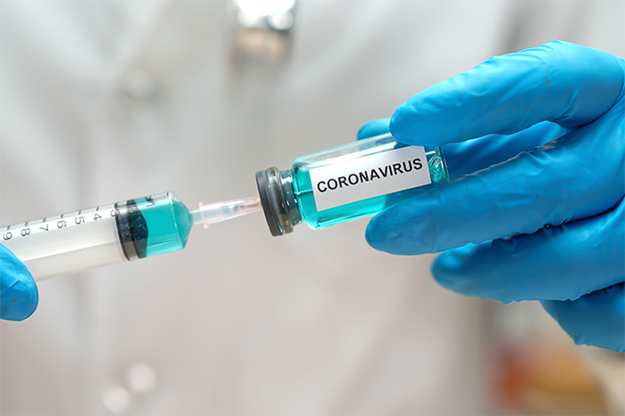

# covid19
website sobre covid19
<!DOCTYPE html>
<html>
<head>
<title>Covid-19 Notícias</title>
</head>
<body>

<h1>This is a Heading</h1>

This is a paragraph.

</body>
</html>
1. G1.globo.com
2. Veja.com
3. Canal BBC News Brasil-Canal do Youtube
4. Nine News Australia-Canal do Youtube
5. Senado notícias
6. Podcast MPSC

<link rel="Contato" href="https://www.linkedin.com/in/juliana-brunes-pimentel-4445691a4/">

body {
    background-image: url(imagem.jpg);
    font-family: Georgia, 'Times New Roman', Times, serif;
    text-align-last: center;
    color: #0e0101;
}

.header {
    text-align-last: auto;
}

.imagem {
   text-align-last: center;
}

.video1 {
    width: 200px;
    height: 200px;  
    background-position-x: right;
}

.video2 {
     background-position-y: left;
     width: 200;
}

.contato{
    text-align: right;

}

.footer {
    box-sizing: border-box;
    background-color: black;
    text-align: center;
}
<!DOCTYPE html>
<html lang="pt">
<head>
<title>Covid-19 Notícias</title>
<meta charset="utf-8">
<meta name="viewport" content="width=device-width, initial-scale=1">

</head>
<body>

<header>
  <h2>Covid-19 Notícias</h2>
</header>

<section>
  <nav>
    <ul>
      

        <a href="index.html">Home |</a>
        

  <article>
    <h1>
Remédios e vacinas começam a ser testados em diversos países
</h1>
    
Australia e Brasil já estão na corrida em busca de vacinas e medicamentos eficazes contra o novo vírus Covid-19.
 
    

  

</article>
</section>

<footer>
  

    2020 By Juliana Brunes Pimentel
 

</footer>

</body>
</html>

<!DOCTYPE html>
<html>
     
    <head>
         <title> Covid-19 Fique em casa! </title>
         <link rel="stylesheet" href="estilo.css"/>

    </head>
<body>

      
 
           <h1> Covid-19 Notícias </h1>

           

            <h1> MCTIC anúncia estudo de possíveis medicamentos </h1>
        
            

                  O Ministério de Ciência, Tecnologia, Inovações e Comunicações (MCTIC) anunciou nesta quarta-feira (15) que uma pesquisa vai testar, em pacientes, se um medicamento já disponível no Brasil pode ser eficaz contra a Covid-19.

                  Em Brasília, o ministro Marcos Pontes disse que a droga teve resultados positivos em testes de laboratório conduzidos por pesquisadores do Centro Nacional de Pesquisa em Energias e Materiais (CNPEM). Segundo Pontes, o nome do medicamento não será divulgado durante a fase de pesquisa.
                  
                  O medicamento faz parte de um estudo que analisou mais de 2 mil moléculas já conhecidas na produção de remédios. Segundo o CNPEM, a droga se mostrou capaz de reduzir em até 94% a carga viral nos ensaios celulares.
                  
                  Agora, depois dos resultados com células infectadas em laboratório, o fármaco será analisado em uma fase de testes clínicos: ele será aplicado em um grupo de 500 pacientes. A expectativa é que esta fase dure ao menos um mês.
                  
                  Os testes em humanos para tratamento da Covid-19 foram aprovados pelo pelo Conselho Nacional de Ética em Pesquisa (Conep) e serão realizados em sete hospitais no Brasil.
                  Os pacientes que serão selecionados para os testes precisam ter a confirmação de que estão com Covid-19. Só serão escolhidas pessoas acima de 18 anos. Todos os envolvidos terão de assinar um termo de consentimento. Por causa do protocolo adotado no trabalho científico, nem paciente nem médico terão acesso ao nome do medicamento administrado.

                  De acordo com o CNPEM, o nome do fármaco, que tem baixo custo e ampla distribuição no território nacional, será mantido em sigilo até que os resultados de testes clínicos sejam concluídos.

                  "Temos boas perspectivas que os resultados dessa pesquisa possam ser positivos e assim poderemos ajudar não só o Brasil, como outros países no combate à Covid-19", disse o ministro do MCTIC, Marcos Pontes, durante entrevista coletiva.  
            

            

             

            <h1> Como será o teste? </h1>

            

                  De acordo com o ministro, o medicamento será administrado por cinco dias seguidos e depois o paciente será observado por mais nove dias. Durante todo o período serão realizadas avaliações e coletas de dados clínicos e laboratoriais.
                  Uma das perguntas que os pesquisadores tentam responder com os testes clínicos é se a droga terá eficácia no combate à replicação do vírus no organismo. Por isso, será importante analisar no grupo de testes qual a carga viral diariamente, para saber se o medicamente terá, no corpo, o mesmo efeito demonstrado nos ensaios in vitro.

                  De acordo com o MCTIC, o medicamento é "economicamente acessível", é "bem tolerado em geral" e já é atualmente "usado por pessoas de diversos perfis".
            

            <table class="ShekCrowley" width="100%">
                  <tbody>
                     <tr>
                        <td><iframe width="460" height="315" src="https://www.youtube.com/embed/G1LoovRQQS4" frameborder="0" allowfullscreen></iframe></td>
                        <td><iframe width="460" height="315" src="https://www.youtube.com/embed/JKQPI_zeBYA" frameborder="0" allowfullscreen></iframe></td>
                     </tr>
                  </tbody>
               </table>
                  
                   

                  
                  <h2>Guia para comunicação Covid 19 Rádio Senado </h2>
            <embed src="audio.mp3" type="audio/mpeg">
     
  
      

       
          

</style>

      <h1>Sobre</h1>
      
Juliana Brunes, programadora apaixonada por games e tecnologias, estudante de programação.

    

      

            <h3>Contato</h3>
            <form method="get" action="envio_dados.php">
              <input type="text" name="nome" placeholder="digite seu Nome aqui">
              <input type="e-mail" name="email" placeholder="Digite seu e-mail">
              <input type="submit" name="enviar" value="Enviar">    
          </form>

      

            

            <a href="https://www.linkedin.com/in/juliana-brunes-pimentel-4445691a4/">  
            

      

   </table>

      

            Saiba Mais
            
G1.globo.com|
 Veja.com|
Canal BBC News Brasil-Canal do Youtube|
Nine News Australia-Canal do Youtube|
Senado notícias|
Podcast MPSC

      

 
      </body>

</html>
